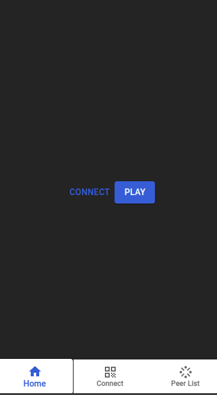

# Streamit
Stream music across multiple devices creating your own speaker setup. \
Check out [Streamit](https://stream.mani1911.work.gd) for the demo version of this project

## Currently in Experimentation and Testing!

1. Install dependencies
```
    yarn install
```

2. Make sure signalling server is running on corresponding host and port mentioned in config.
```
    docker run --name <container-name> -p <port>:9000 -d peerjs/peerjs-server

``` 

3. Run the development server
```
    yarn dev
```

## Usage
- Get QR Code of the peer to connect with


- Scan the QR code using the scanner to connect with peer


- Click on connect to connect and stream music with the peers connected and press play to start listening to music  



